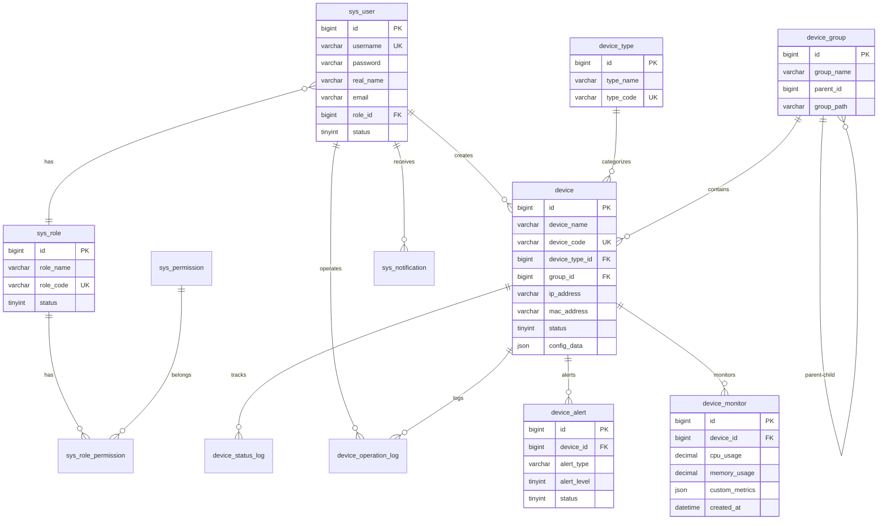

# 数据库设计说明

## 数据库概览

本系统使用 MySQL 8.0+ 数据库，共设计了 **13 张表**，分为以下几个模块：

### 1. 用户权限模块（4张表）
- `sys_user` - 用户表
- `sys_role` - 角色表
- `sys_permission` - 权限表
- `sys_role_permission` - 角色权限关联表

### 2. 设备管理模块（4张表）
- `device` - 设备信息表（核心表）
- `device_type` - 设备类型表
- `device_group` - 设备分组表
- `device_monitor` - 设备监控数据表

### 3. 告警日志模块（3张表）
- `device_alert` - 设备告警表
- `device_operation_log` - 设备操作日志表
- `device_status_log` - 设备状态变更日志表

### 4. 系统配置模块（2张表）
- `sys_config` - 系统配置表
- `sys_notification` - 通知消息表

---

## 核心表详细说明

### 1. device（设备信息表）

**核心字段：**
- `device_name` - 设备名称
- `device_code` - 设备编码（唯一）
- `device_type_id` - 设备类型（外键关联 device_type）
- `group_id` - 所属分组（外键关联 device_group）
- `status` - 设备状态（0-离线，1-在线，2-故障，3-维护中）
- `ip_address` / `mac_address` - 网络信息
- `config_data` - JSON 格式的配置数据（MySQL 8 支持 JSON 类型）

**设计亮点：**
- 使用 JSON 字段存储灵活的配置数据
- 支持设备分组和类型分类
- 记录设备完整生命周期信息（购买日期、保修日期等）

### 2. device_monitor（设备监控数据表）

**核心字段：**
- `cpu_usage` / `memory_usage` / `disk_usage` - 系统资源使用率
- `network_upload` / `network_download` - 网络流量
- `custom_metrics` - JSON 格式的自定义监控指标

**设计亮点：**
- 时序数据存储，按时间索引
- 支持自定义监控指标扩展
- 可定期清理历史数据（建议保留近3个月）

### 3. device_alert（设备告警表）

**核心字段：**
- `alert_type` - 告警类型（离线、CPU过高、内存过高等）
- `alert_level` - 告警级别（1-提示，2-警告，3-严重，4-紧急）
- `status` - 处理状态（0-未处理，1-处理中，2-已处理，3-已忽略）

**设计亮点：**
- 支持告警处理流程跟踪
- 记录告警值和阈值，便于分析
- 支持告警分级管理

---

## 表关系图（ER图）



---

## 索引设计

### 主键索引
所有表都使用 `id` 作为主键，采用 `BIGINT AUTO_INCREMENT`

### 唯一索引
- `sys_user.username` - 用户名唯一
- `device.device_code` - 设备编码唯一
- `device_type.type_code` - 设备类型编码唯一
- `sys_role.role_code` - 角色编码唯一

### 普通索引
- `device.device_type_id` - 按设备类型查询
- `device.group_id` - 按分组查询
- `device.status` - 按状态筛选
- `device.ip_address` - 按IP查询
- `device_monitor.device_id` - 监控数据查询
- `device_monitor.created_at` - 时间范围查询
- `device_alert.device_id` - 告警查询
- `device_alert.status` - 按处理状态筛选

---

## 数据字典

### 设备状态枚举
| 值 | 说明 | 颜色标识 |
|---|---|---|
| 0 | 离线 | 灰色 |
| 1 | 在线 | 绿色 |
| 2 | 故障 | 红色 |
| 3 | 维护中 | 橙色 |

### 告警级别枚举
| 值 | 说明 | 颜色标识 |
|---|---|---|
| 1 | 提示 | 蓝色 |
| 2 | 警告 | 黄色 |
| 3 | 严重 | 橙色 |
| 4 | 紧急 | 红色 |

### 告警处理状态
| 值 | 说明 |
|---|---|
| 0 | 未处理 |
| 1 | 处理中 |
| 2 | 已处理 |
| 3 | 已忽略 |

### 操作类型
- `add` - 添加设备
- `edit` - 编辑设备
- `delete` - 删除设备
- `restart` - 重启设备
- `start` - 启动设备
- `stop` - 停止设备
- `update_firmware` - 更新固件

---

## 初始化数据说明

### 默认角色
1. **超级管理员（SUPER_ADMIN）** - 拥有所有权限
2. **管理员（ADMIN）** - 系统管理员
3. **运维人员（OPERATOR）** - 设备运维人员
4. **普通用户（USER）** - 只读权限

### 默认用户
- 用户名：`admin`
- 密码：`admin123`（BCrypt 加密后存储）
- 角色：超级管理员

### 默认设备类型
- 服务器（SERVER）
- 路由器（ROUTER）
- 交换机（SWITCH）
- 摄像头（CAMERA）
- 传感器（SENSOR）
- 工控机（IPC）
- 其他（OTHER）

### 默认设备分组
- 全部设备（根分组）
  - 机房A
  - 机房B
  - 办公区

---

## 性能优化建议

### 1. 分区表（可选）
对于数据量大的表，可以考虑分区：
- `device_monitor` - 按月分区（时间范围查询优化）
- `device_operation_log` - 按月分区
- `device_status_log` - 按月分区

### 2. 数据归档
定期归档历史数据：
- 监控数据保留 3-6 个月
- 操作日志保留 1 年
- 告警记录保留 1 年

### 3. 读写分离
- 主库：写操作
- 从库：读操作（查询、报表）

### 4. 缓存策略
使用 Redis 缓存：
- 设备列表（5分钟过期）
- 设备类型（长期缓存）
- 用户权限（30分钟过期）

---

## 数据库连接配置示例

### application.yml
```yaml
spring:
  datasource:
    url: jdbc:mysql://localhost:3306/device_control?useUnicode=true&characterEncoding=utf8mb4&serverTimezone=Asia/Shanghai&useSSL=false
    username: root
    password: your_password
    driver-class-name: com.mysql.cj.jdbc.Driver
    
  jpa:
    hibernate:
      ddl-auto: none  # 生产环境使用 none，开发环境可用 update
    show-sql: true
    properties:
      hibernate:
        format_sql: true
        dialect: org.hibernate.dialect.MySQL8Dialect

mybatis-plus:
  mapper-locations: classpath*:/mapper/**/*.xml
  type-aliases-package: com.example.devicecontrol.entity
  configuration:
    map-underscore-to-camel-case: true
    log-impl: org.apache.ibatis.logging.stdout.StdOutImpl
```

---

## 使用说明

### 1. 导入数据库
```bash
# 登录 MySQL
mysql -u root -p

# 执行 SQL 脚本
source /path/to/schema.sql
```

### 2. 验证数据
```sql
-- 查看所有表
SHOW TABLES;

-- 查看初始化数据
SELECT * FROM sys_user;
SELECT * FROM sys_role;
SELECT * FROM device_type;
SELECT * FROM device_group;
```

### 3. 修改默认密码
首次使用后，请立即修改默认管理员密码！
